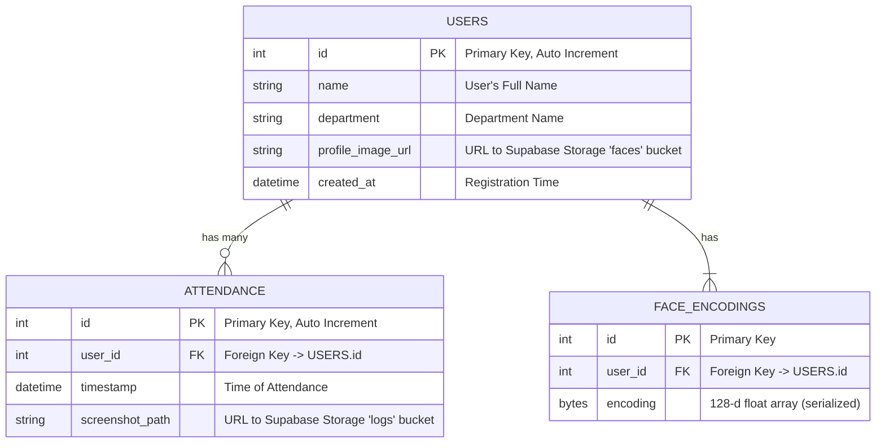

# Entity Relationship Diagram (ERD)

This diagram represents the schema hosted on **Supabase PostgreSQL**.

## Storage Architecture (Supabase Storage)

* **Bucket: `faces`**
  * **Purpose**: Stores reference photos of users.
  * **Access**: Public Read.
  * **Permissions**: Public Upload (via Policy).

* **Bucket: `logs`**
  * **Purpose**: Stores security screenshots / evidence of attendance.
  * **Access**: Public Read.
  * **Permissions**: Public Upload (via Policy).
