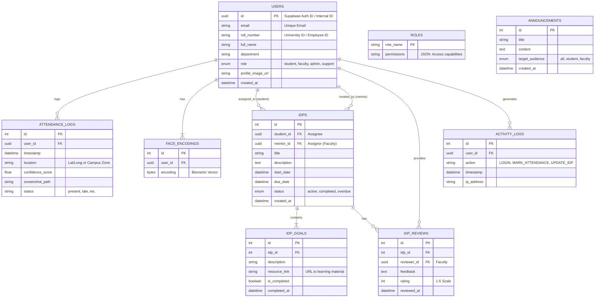

# University Enterprise System - System Design & ER Diagram

## 1. System Architecture Overview

The system follows a typical **3-Tier Architecture**:

1. **Frontend Layer (Client)**:
    * **React + TypeScript + Tailwind CSS**: Provides role-based dashboards (Student, Faculty, Admin).
    * **Interactive Components**: IDP trackers, Charts (Recharts), and Real-time notifications.
    * **Biometrics**: Connects to user camera for real-time face capture during attendance on the client side (or sends frame to backend).

2. **Application Layer (Backend API)**:
    * **FastAPI (Python)**: High-performance, async API.
    * **Authentication**: Supabase Auth (JWT) + RBAC Middleware.
    * **Logic Modules**:
        * `Attendance Engine`: Validates face embeddings.
        * `IDP Manager`: Handles plan assignments and progress tracking.
        * `Analytics Service`: Aggregates data for dashboards.

3. **Data Layer (Database & Storage)**:
    * **Supabase PostgreSQL**: Relational data, vector storage for embeddings (optional), and real-time subscriptions.
    * **Supabase Storage**: Buckets for `faces` (enrollment) and `logs` (attendance snapshots).

---

## 2. Entity Relationship Diagram (ERD)

## 3. Database Schema Details

### 3.1 Users Table (`users`)

Central identity table linked to Supabase Auth.
* **role**: Crucial for RBAC.
  * `student`: Standard access (Attendance, My IDP).
  * `faculty`: Manager access (Assign IDP, View Student Attendance).
  * `admin`: System management (User CRUD, Enforce Policies).

### 3.2 Individual Development Plans (`idps`)

Represents the growth container.
* **Workflow**:
    1. Faculty creates IDP for Student.
    2. Student views IDP and completes Goals.
    3. System updates IDP status based on Goal completion (`idp_goals`).
    4. Faculty provides feedback via `idp_reviews`.

### 3.3 Attendance (`attendance_logs`)

- **Validation**: Entry created only if Face Recognition Confidence > Threshold (e.g., 0.6).
* **Audit**: Stores `screenshot_path` for manual verification if dispute arises.

## 4. Security & RBAC Policies

| Resource | Student Access | Faculty Access | Admin Access |
| :--- | :--- | :--- | :--- |
| **Attendance** | View Own | View Assigned Students | View All + Export |
| **IDP** | View/Update Own | Create/Review Assigned | Monitor Statistics |
| **User Mgmt** | Read Only (Profile) | Read Only (Dept) | Create/Edit/Delete |
| **System** | None | None | Full Access |
