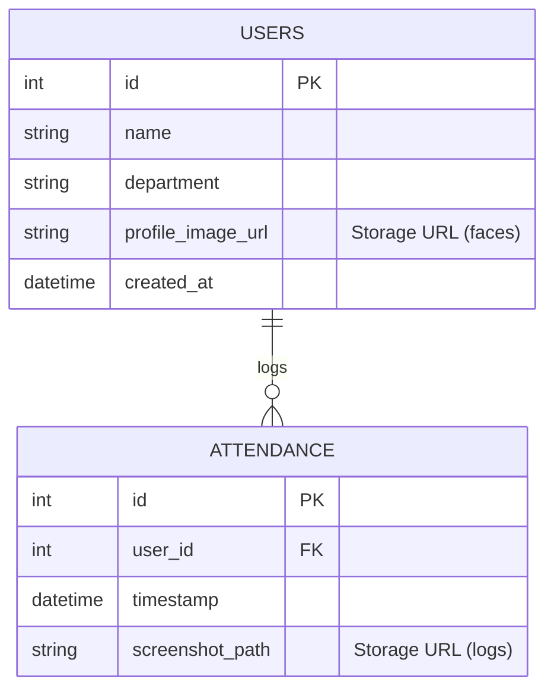

# Face Attendance System Architecture

> [!NOTE]
> **Project Goal**: A contactless, AI-powered attendance system replacing legacy manual methods with real-time Face Recognition.

## 1. Executive Summary & Impact

### Problem Statement

Traditional attendance methods (Paper logs, ID cards, Biometrics) suffer from:

* **Inefficiency**: Queues during rush hours.
* **Fraud**: "Buddy Punching" (proxies) or lost ID cards.
* **Hygiene**: Contact-based sensors can spread germs.

### Real-Life Impact
>
> [!IMPORTANT]
> This system democratizes security by bringing **Enterprise-Grade AI** to standard commodity hardware (Webcams/Laptops).

* **🚀 Efficiency**: < 200ms recognition time. Zero-touch flow.
* **🛡️ Integrity**: Immutable cloud logs with "Evidence Photos" audit trails.
* **📱 Accessibility**: Mobile-first Dashboard for remote monitoring.
* **💰 Cost-Effective**: Leveraging specialized Cloud/Client split architecture to run on Free Tier infrastructure.

---

## 2. System Workflow

### A. User Registration

1. **Admin** inputs details + Photo via **React Dashboard**.
2. **Frontend** sends data to **Backend API** (`POST /users/`).
3. **Backend** orchestrates:
    * Uploads photo to **Supabase Storage** (`faces` bucket).
    * *Client-Side Process*: Logic calculates **Face Encoding** (128-d vector).
    * Saves Metadata + Encoding to **Supabase DB**.

### B. Real-Time Attendance

1. **Camera Client** (Python/OpenCV) captures video stream.
2. **Detection**: Extracts face locations.
3. **Recognition**: Compares live face with "Known Encodings".
    * *Algorithm*: Euclidean Distance < 0.5 threshold.
4. **Logging**:
    * On Match: Sends `User ID` + `Screenshot` to Backend.
    * Backend logs timestamp and uploads evidence to `logs` bucket.

---

## 3. Data Architecture (ER Diagram)

The system relies on a relational schema hosted on **Supabase (PostgreSQL)**.

> [!TIP]
> **Storage Buckets**:
>
> * `faces`: Reference images (Profile pics).
> * `logs`: Security audit trail (Snapshots of the moment of attendance).

---

## 4. Technology Stack

### Frontend (The User Interface)

* **React 18 + Vite**: High-performance SPA.
* **TailwindCSS**: Utility-first styling for mobile responsiveness.
* **Lucide React**: Modern iconography.

### Backend (The Brain)

* **FastAPI (Python)**: Async, type-safe REST API.
* **Pydantic**: Data validation.
* **SQLAlchemy**: ORM for database interactions.

### Infrastructure (The Cloud)

* **Supabase**: Managed PostgreSQL + Object Storage + Auth.
* **Render**: Containerized Backend Hosting.
* **Vercel**: Frontend CDN Hosting.
* **GitHub**: CI/CD Pipeline.

### Computer Vision (The Eyes)

* **OpenCV**: Image pre-processing.
* **Face_Recognition (dlib)**: HOG + CNN models for state-of-the-art accuracy (99.38% on LFW benchmark).
